<h3><code>deekshith06@github ~ $ ./contributions.sh</code></h3>

  

<h3><code>deekshith06@github ~ $ whoami</code></h3>

<table>
<tr>
<td valign="top"></td>
<td valign="top"></td>
</tr>
</table>

  

<h3><code>deekshith06@github ~ $ ./about.sh</code></h3>

<b>Full-Stack Developer · AI/ML Builder · B.Tech CSE Student</b>

B.Tech in Computer Science and Engineering at Lovely Professional University · Expected graduation: 2027

